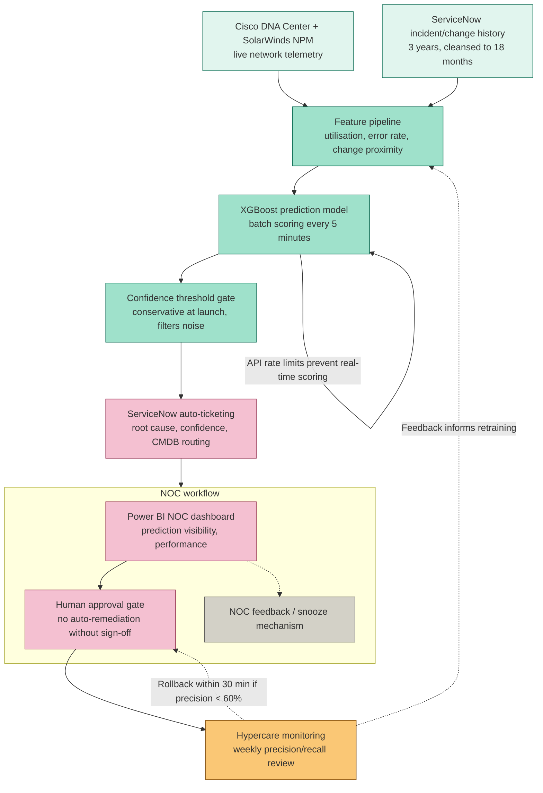

# Architecture

**NetSentinel AI — Predictive Network Incident Management & Auto-Remediation Platform**

> Reflects the core technology stack from the Project Overview, the hybrid Waterfall/Agile delivery model, and the human-approval-gate design enforced throughout. See the [README](./README.md) for full project context, [04-WBS.md](./04-WBS.md) for how this maps to delivery work packages, and [10-Product-Backlog.md](./10-Product-Backlog.md) Epic 3–4 for the backlog items that built each component.

---

## System Architecture

*(GitHub renders Mermaid diagrams natively in `.md` files — no image export needed. If viewing this file outside GitHub, paste the code block into [mermaid.live](https://mermaid.live) to render it.)*

---

## Component Breakdown

| Component | Role | Linked Decision |
|---|---|---|
| **Cisco DNA Center + SolarWinds NPM** | Live network telemetry source for WAN links, switches, and routers across 40 branches and 3 data centres | [Business Case](./02-Business-Case.md) — existing telemetry identified as the data foundation for in-house build |
| **ServiceNow incident/change history** | 3 years of historical labels; descoped to 18 months of usable, cleansed data | [RAID Log](./07-RAID-Log.md) I1 — data volume larger than estimated, descoped as a documented trade-off |
| **Feature pipeline** | Engineers link-utilisation, error-rate, and change-proximity features | [Sprint Plan](./09-Sprint-Plan.md) Sprints 3–4, 6 — change-proximity features escalated from Should to Must after the precision miss |
| **XGBoost prediction model** | Scores network elements for incident risk on a 5-minute batch cycle | [Risk Register](./08-Risk-Register.md) R5 — real-time scoring ruled out by Cisco DNA Center API rate limits |
| **Confidence threshold gate** | Filters predictions to higher-confidence cases before a ticket is created | [Risk Register](./08-Risk-Register.md) R4 — conservative threshold set deliberately to protect NOC trust at launch |
| **ServiceNow auto-ticketing** | Creates a ticket with predicted root cause, confidence score, and correct CMDB routing | [RAID Log](./07-RAID-Log.md) I3 — CMDB mapping defect caught and fixed pre-UAT |
| **Power BI NOC dashboard** | Surfaces prediction visibility and live model performance to NOC shift teams | [Product Backlog](./10-Product-Backlog.md) BL-18 |
| **Human approval gate** | Hard architectural boundary — no automated remediation action reaches production without explicit human sign-off | Charter constraint — zero unplanned production changes from automation, confirmed at closure |
| **NOC feedback / snooze mechanism** | Lets NOC analysts downrank unreliable prediction types | [Product Backlog](./10-Product-Backlog.md) BL-21 — added reactively in execution; flagged at retrospective as something that belonged in the MVP |
| **Hypercare monitoring** | Weekly precision/recall review with a defined rollback trigger | [12-Budget.md](./12-Budget.md) and closure runbook — 30-minute rollback capability if precision falls below the 60% floor |

---

## Why This Architecture

### Batch scoring, not real-time
The original schedule assumed real-time DNA Center API scoring. Rate-limit testing in Week 2 showed this wasn't viable, so the architecture was revised to 5-minute batch scoring before the team committed to the schedule — later tuned to 2-minute batches post-pilot via CR-04, once pilot feedback justified the tighter latency and the API headroom supported it.

### A hard human-approval boundary, not a policy statement
The model's output stops at "prediction + ticket" — it never reaches a system capable of pushing a change to production. This was a deliberate architectural decision, not just a written policy, made specifically to address the accountability question raised at kickoff: *"Who is accountable if the model recommends a wrong action and causes an outage?"* In Phase 1, the answer is nobody, by design — because the architecture doesn't allow the model to act unilaterally.

### Why explainable root-cause output, not just a risk score
Every ticket includes a predicted root cause and confidence score, not just a binary flag — directly supporting NOC trust-building, since shift teams could see *why* a prediction was made, not just *that* one was made. This was central to overcoming the "another dashboard nobody uses" concern raised at kickoff.

---

## Human-in-the-Loop Design Reflected in This Architecture

- The Power BI dashboard and the human approval gate sit inside the same NOC workflow boundary, reinforcing that the dashboard's purpose is to inform a human decision, not replace one.
- The NOC feedback/snooze mechanism feeds back toward the feature pipeline (dashed line), representing the retraining feedback loop — though this was added reactively during execution rather than shipped in the original MVP, a lesson captured directly in [Lessons Learned](./README.md).
- The dashed rollback line from hypercare monitoring back to the human approval gate represents the documented 30-minute rollback capability — disable auto-ticketing, revert to manual NOC monitoring — triggered if model precision falls below a 60% floor.

---

*Part of the [NetSentinel AI](./README.md) case study by Prachi Sharma.*
